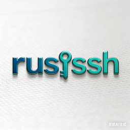
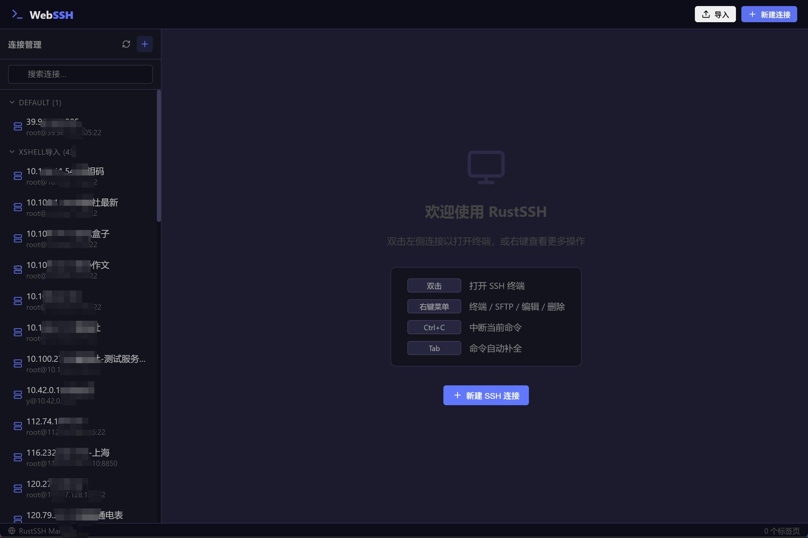
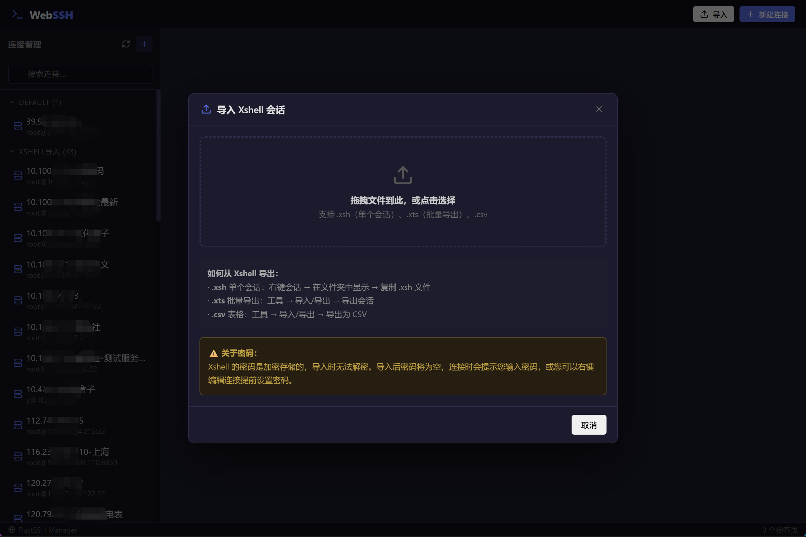

# RustSSH Manager

<p align="center">
  
</p>

<p align="center">
  <b>A modern, lightweight SSH client built with Rust and Tauri</b><br>
  <b>基于 Rust 和 Tauri 构建的现代化轻量级 SSH 客户端</b>
</p>


<p align="center">
  <a href="#features">Features</a> •
  <a href="#installation">Installation</a> •
  <a href="#usage">Usage</a> •
  <a href="#building-from-source">Building</a> •
  <a href="#tech-stack">Tech Stack</a>
</p>

---

## Features | 功能特性

### Core Features | 核心功能
- 🔐 **SSH Terminal** - Full-featured terminal with xterm.js, supporting colors, themes, and search
- 📁 **SFTP File Manager** - Built-in file transfer with drag-and-drop support
- 🔑 **Multiple Authentication** - Password and SSH key authentication
- 📂 **Session Management** - Organize connections with groups and folders
- 📥 **Xshell Import** - Import sessions from Xshell (.xsh, .xts, .csv formats)
- 🌐 **Cross-Platform** - Windows, macOS, and Linux support

### Terminal Features | 终端功能
- 🎨 **Multiple Themes** - Dark, Light, Solarized, Monokai
- 🔍 **Search Functionality** - Find text in terminal output
- 📋 **Clipboard Integration** - Copy/paste support
- ⌨️ **Keyboard Shortcuts** - Ctrl+C for interrupt, Tab for autocomplete
- 🔤 **Font Scaling** - Adjustable font size (10-24px)

### Security | 安全性
- 🔒 **Local Data Storage** - All connection data stored locally in JSON
- 🚫 **No Password Collection** - Imported passwords are cleared (Xshell encryption cannot be decrypted)
- 🛡️ **Secure SSH Implementation** - Built on rust-ssh2 library

---

## Installation | 安装

### Download Pre-built Binaries | 下载预编译版本

Download the latest release for your platform from the [Releases](https://github.com/yourusername/rustssh-manager/releases) page.

从 [Releases](https://github.com/yourusername/rustssh-manager/releases) 页面下载适合您平台的最新版本。

### Supported Platforms | 支持平台

- Windows 10/11 (x64)
- macOS 11+ (Intel & Apple Silicon)
- Linux (x64, ARM64)

---

## Usage | 使用方法

### Quick Start | 快速开始

1. **Add a Connection | 添加连接**
   - Click "New Connection" button
   - Enter host, port, username, and password/SSH key
   - Click Save

2. **Connect | 连接**
   - Double-click a connection in the sidebar
   - Or click the terminal icon

3. **SFTP Transfer | 文件传输**
   - Right-click a connection → "SFTP File Manager"
   - Drag and drop files to upload/download

### Import from Xshell | 从 Xshell 导入

1. Click "Import" button in the header
2. Select your Xshell export file (.xts, .xsh, or .csv)
3. Preview the connections to import
4. Click "Import" to confirm


**Note**: Passwords are not imported (Xshell uses encryption). You'll need to set passwords manually after import.

**注意**：密码不会被导入（Xshell 使用加密）。导入后需要手动设置密码。

### Keyboard Shortcuts | 快捷键

| Shortcut | Action |
|----------|--------|
| `Ctrl+C` | Interrupt current command |
| `Tab` | Command autocomplete |
| `Ctrl+Plus` | Increase font size |
| `Ctrl+Minus` | Decrease font size |

---

## Building from Source | 从源码构建

### Prerequisites | 前置要求

- [Rust](https://rustup.rs/) (1.70+)
- [Node.js](https://nodejs.org/) (18+)
- [Git](https://git-scm.com/)

### Build Steps | 构建步骤

```bash
# Clone the repository
git clone https://github.com/yourusername/rustssh-manager.git
cd rustssh-manager

# Install dependencies
npm install

# Run in development mode
npm run tauri:dev

# Build for production
npm run tauri:build
```

The built application will be in `src-tauri/target/release/`.

构建好的应用位于 `src-tauri/target/release/` 目录。

---

## Tech Stack | 技术栈

| Component | Technology |
|-----------|------------|
| **Frontend** | React 18 + Vite |
| **Backend** | Rust + Tauri 2.0 |
| **Terminal** | xterm.js |
| **SSH/SFTP** | ssh2 (Rust) |
| **UI Icons** | Lucide React |
| **Styling** | CSS3 |

---

## Project Structure | 项目结构

```
rustssh-manager/
├── frontend/           # React frontend
│   ├── src/
│   │   ├── App.jsx    # Main application
│   │   ├── Terminal.jsx    # Terminal component
│   │   ├── SftpPanel.jsx   # SFTP file manager
│   │   ├── Sidebar.jsx     # Connection list
│   │   └── ...
│   └── package.json
├── src-tauri/         # Rust backend
│   ├── src/
│   │   ├── main.rs         # Entry point
│   │   ├── connection.rs   # Connection CRUD
│   │   ├── terminal.rs     # SSH terminal logic
│   │   ├── sftp.rs         # SFTP operations
│   │   └── import.rs       # Xshell import
│   └── Cargo.toml
└── README.md
```

---

## Contributing | 贡献

Contributions are welcome! Please feel free to submit a Pull Request.

欢迎贡献！请随时提交 Pull Request。

### Development Guidelines | 开发规范

1. Fork the repository
2. Create your feature branch (`git checkout -b feature/amazing-feature`)
3. Commit your changes (`git commit -m 'Add some amazing feature'`)
4. Push to the branch (`git push origin feature/amazing-feature`)
5. Open a Pull Request

---

## License | 许可证

This project is licensed under the MIT License - see the [LICENSE](LICENSE) file for details.

本项目采用 MIT 许可证 - 详见 [LICENSE](LICENSE) 文件。

---

## Acknowledgments | 致谢

- [Tauri](https://tauri.app/) - For the amazing desktop framework
- [xterm.js](https://xtermjs.org/) - For the terminal emulator
- [ssh2-rs](https://github.com/alexcrichton/ssh2-rs) - For SSH/SFTP implementation
- [Lucide](https://lucide.dev/) - For the beautiful icons

---

## Support | 支持

If you encounter any issues or have questions, please [open an issue](https://github.com/yourusername/rustssh-manager/issues).

如果遇到问题或有疑问，请[提交 Issue](https://github.com/yourusername/rustssh-manager/issues)。

---

<p align="center">
  Made with ❤️ using Rust and Tauri
</p>
